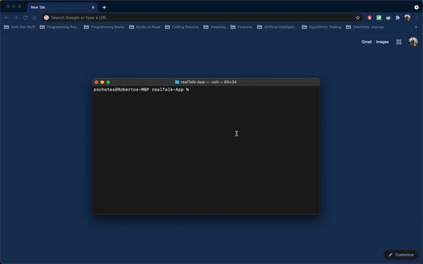
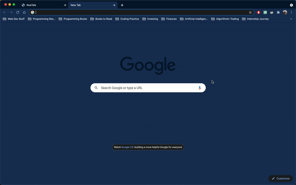

# RealTalk
RealTalk is a node.js live chat application powered by Socket.io and Express.

## Features
* Responsive "User is typing..." event
* Handles countless participant activity
* Provides System alerts about user events
* Real-time communication access

## How it Works
RealTalk uses sockets (protocols that a node uses to send/recieve data across the internet) to communicate from computer to computer. They are actively looking for signals to pickup and send once instructed. The `socket.on(eventName, callback)` picks up events from sockets and decides to send it to server and vice versa. The client-server model works seamlessly sending each other events and displaying it to the browser.

The GIF below demonstrates the functionality of RealTalk:

It also works well handling multiple sockets at a time:

## Installation

To view this app, clone this repository and use `npm install` to download all dependancies. You might need to revise the package.JSON file to choose your own port needed and update versions of dependencies.

On the Command Line, run the application using:

`node server.js`

On the browser, type `localhost:<specified-port>` to view the app running.

ENJOY!